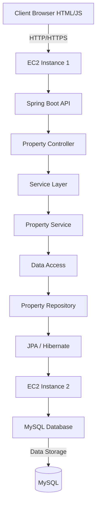

# AREP-LAB05
LAB 05 - AREP

# Property Management CRUD System

## Introduction

This workshop emphasizes key software development skills such as client-server communication, REST API design, database persistence with JPA/Hibernate, and handling errors. Optional enhancements like pagination, search functionality, and user feedback are encouraged to further improve the application.


## Application description

The developed application is a manager for a property list. It allows users to add property to a list along with a detailed description to facilitate organization and tracking during shopping. The application demonstrates how the web server can handle requests to add property, list existing property, and serve static content such as HTML, using Spring Boot frameworks.

## Starting

The following instructions will allow you to get a working copy of the project on your local machine for development and testing purposes.

### Build with:
    
* [Git](https://git-scm.com) - Version Control System
* [Maven](https://maven.apache.org/download.cgi) -  Dependency Management
* [java](https://www.oracle.com/java/technologies/downloads/#java22) - Programming Language

### Requirements:

#### ⚠️ Important

You need to have installed Git, Maven 3.9.9 and Java 17 to be able to execute the proyect

## Project Summary

This Property Management System is a web-based application that allows users to:

* Add new property listings
* View a complete list of properties along with detailed information for each
* Modify existing property details
* Remove property listings
* The application features a frontend built with HTML and JavaScript, a backend REST API implemented using Spring Boot, and a MySQL database for storing and managing data.


## System Architecture

The system is designed with a three-tier architecture and is deployed on AWS:

* Frontend: HTML + JavaScript
    * Runs in the user's browser
    * Communicates with the backend API via AJAX or Fetch API

* Backend: Spring Boot REST API

    * Deployed on EC2 instance 1
    * Provides RESTful endpoints for CRUD operations
    *  Manages business logic and data validation
    *  Interacts with the database using JPA/Hibernate

* Database: MySQL

    * Hosted on EC2 instance 2
    * Stores property information in the properties table

#### System Interaction
The interaction between the system components follows a clear flow:

1. Frontend (HTML + JavaScript): The user interacts with the web interface to create, view, update, or delete property listings. These actions trigger AJAX or Fetch API calls to the backend.

2. Backend (Spring Boot REST API): The backend receives the requests from the frontend, processes them (business logic, data validation), and interacts with the database via JPA/Hibernate to either retrieve or modify data. It then returns the response (e.g., success/failure, data) back to the frontend.

3. Database (MySQL): The backend communicates with the MySQL database hosted on EC2 instance 2, where all property data is stored. CRUD operations are performed on the properties table, and the results are sent back to the backend, which in turn responds to the frontend, updating the user interface as necessary.

### Architecture Diagram



## Class Design

Key classes in the system include:

* Property: Represents a real estate property with attributes such as ID, address, price, size, and description.
* PropertyService: Handles business logic for property management.
* AllControlller: Handles HTTP requests directed at the root URL ("/").
* RealStateController: Exposes REST endpoints for property operations.
* PropertyRepository: Interfaces with the database for data persistence.


## Deployment Instructions

### Installation and Execution

To install and run this application locally, follow these steps:

1. Clone the repository:

```bash
mvn clean install
git clone https://github.com/CamiloMurcia28/AREP-LAB05.git
cd AREP-LAB05
```

2. Build and run:

```bash
Copy code
mvn clean install
docker-compose up -d
mvn spring-boot:run
```

3. Open the application in a web browser:

Navigate to http://localhost:8080/index.html to interact with the application.

### Deployment

To deploy the system on AWS:

1. Set up an EC2 instance (Instance 1) for the Spring Boot backend service
2. Set up another EC2 instance (Instance 2) for the MySQL database
3. Configure security groups to allow necessary traffic between the instances and from the internet to Instance 1
4. Deploy the frontend HTML/JS files to Instance 1 or serve them from a separate web server
5. Start the Spring Boot service on Instance 1
6. Ensure MySQL is running and properly configured on Instance 2


 ## Deployment Video of the system running

 [VIDEO AWS EC2](https://youtu.be/qo7sLoDTja4)
   
## Running Tests

To execute the test: 

```bash
mvn test
```

## Built With
    * Spring Boot - The backend framework
    * React - The frontend library
    * MySQL - Database
    * Maven - Dependency Management
    * npm - Package Manager for JavaScript

## Versioning


## Author

- Camilo Murcia Espinosa

## License

[](https://creativecommons.org/licenses/by-sa/4.0/deed.es)

This project is licensed under the MIT License - see the [LICENSE](LICENSE) for details

## Acknowledgements

- To Professor [Luis Daniel Benavides Navarro](https://ldbn.is.escuelaing.edu.co) for sharing his knowledge.


